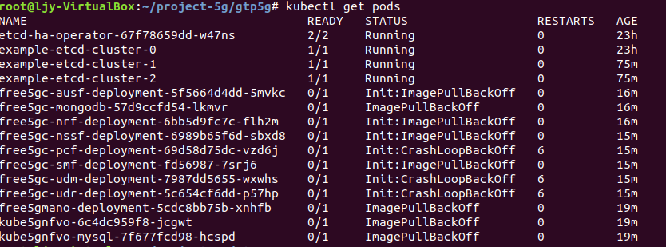
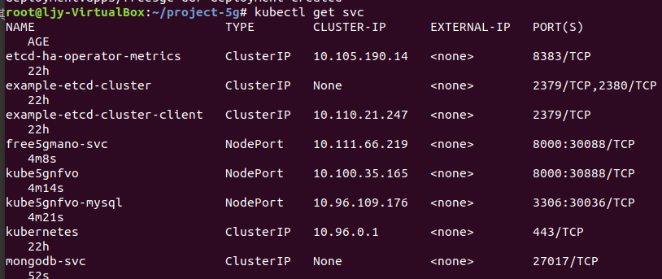
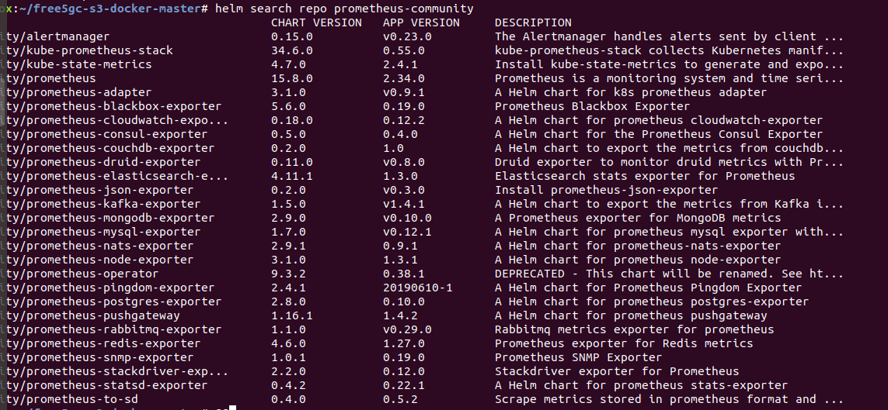
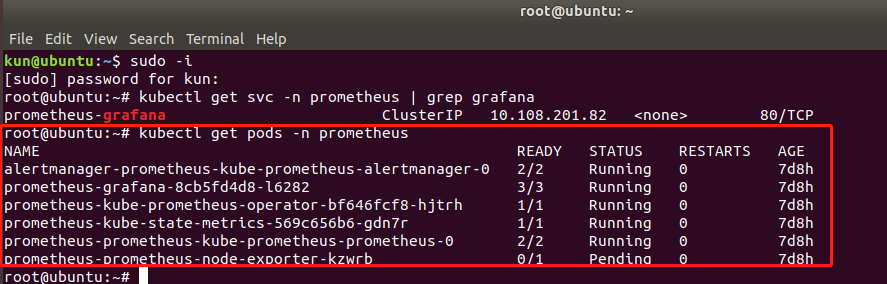
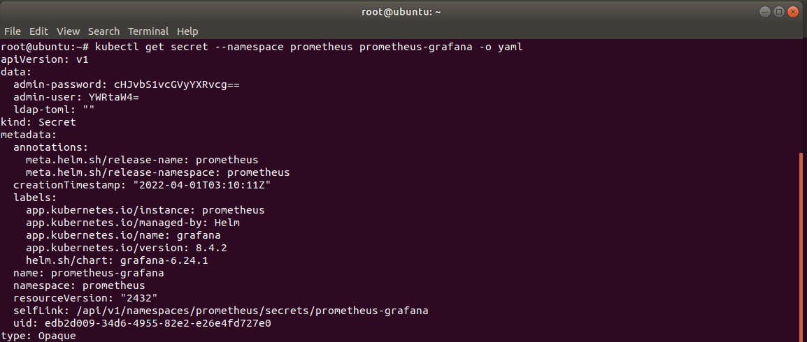
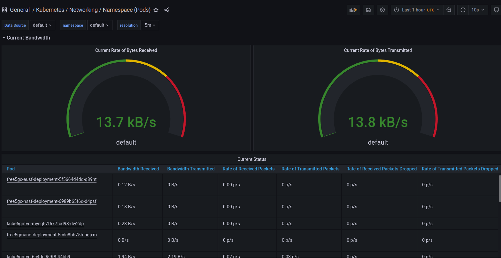
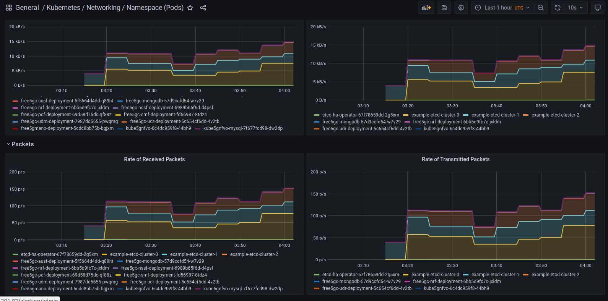

# Using Kubernetes to deploy 5GC network and moniter the service
- [Prerequisites](#prerequisites)
- [Configuration](#configuration)
  - [configure IP tables](#configure-IP-tables)
  - [Install Minikube](#Install-Minikube)
  - [Install kubectl](#Install-kubectl)
  - [Kube-flannel & etcd-ha-operator](#kube\-flannel-\&-etcd\-ha\-operator)
  - [Openvswitch, Multus and OVS-CNI Containers](#openvswitch\,-multus-and-ovs\-cni-containers)
- [Deployments](#Deployments)
- [Grafana prometheus](#Using-grafana\.promtheus-community-to-monitor-5GC-service)
  - [Install helm](#Install-helm-and-verify-it)
  - [Deploy chart](#deploy-chart-of-kube-prometheus-stack)
## prerequisites
We use KVM to create a Linux OS virtual machine, with the configuration and Kernel setup:
- Ubuntu-bionic-18.04 running with Kernel 5.0.0-23 generic with 4G RAM, 10GHDD.
Ensure Docker is running, further steps for installation are at https://docs.docker.com/get-docker/
- Images from free5gc open-source were used. More details on free5gc can be found here https://www.free5gc.org/

```shell
$ sudo apt-get update
sudo apt-get install \
    apt-transport-https \
    ca-certificates \
    curl \
    gnupg-agent \
    software-properties-common
curl -fsSL https://download.docker.com/linux/ubuntu/gpg | sudo apt-key add -
sudo add-apt-repository "deb [arch=amd64] https://download.docker.com/linux/ubuntu​ $(lsb_release -cs) stable"
sudo apt-get update
sudo apt-get install -y docker-ce
```

## configuration

### configure IP tables
Conntrack module provides stateful packet inspection for iptables
Further information is located at http://conntrack-tools.netfilter.org/
```
sudo apt-get update -y
sudo apt-get install -y conntrack
```
Enable IP tables
```
echo "net.bridge.bridge-nf-call-iptables=1" | sudo tee -a /etc/sysctl.conf
sudo sysctl -p
```

### Install Minikube
Minikube is a quick way to deploy a one-node cluster. The cluster can be used for our 5GC deployment.
To see more information of Minikube, please check the website: https://minikube.sigs.k8s.io/docs/start/
```
curl -LO https://storage.googleapis.com/minikube/releases/latest/minikube-linux-amd64
sudo install minikube-linux-amd64 /usr/local/bin/minikube
sudo -E minikube start --driver=none
```
There would be problems if the newest version of Kubernetes is installed. You can clarify which Kubernetes 
version you wish to use when starting a new minikube cluster using the line below:
```
sudo minikube start --driver=none --kubernetes-version=1.18.2
```
In our project, we recommend you use kubernetes version 1.18.2, since higher versions may lead to unknown problems.
Likewise, there are other tools which allow you to run Kubernetes such as Kind. More information please check:
https://kubernetes.io/docs/tasks/tools/

### Install kubectl
The Kubernetes command-line tool, kubectl, allows you to run commands against Kubernetes clusters. 
More details please check: https://kubernetes.io/docs/reference/kubectl/
```
sudo apt-get update && sudo apt-get install -y apt-transport-https gnupg2 curl
curl -s https://packages.cloud.google.com/apt/doc/apt-key.gpg | sudo apt-key add -
echo "deb https://apt.kubernetes.io/ kubernetes-xenial main" | sudo tee -a /etc/apt/sources.list.d/kubernetes.list
sudo apt-get update
sudo apt-get install -y kubectl
```

### Kube-flannel & etcd-ha-operator
Flannel is a simple and easy way to configure a layer 3 network fabric designed for Kubernetes.
Etcd is a strongly consistent, distributed key-value store that provides a reliable way to store 
data that needs to be accessed by a distributed system or cluster of machines. Etcd-hap-operator 
aims to provide a way to deploy etcd in High Availability mode. 
```
sudo kubectl apply -f https://raw.githubusercontent.com/coreos/flannel/master/Documentation/kube-flannel.yml
sudo kubectl create -f https://raw.githubusercontent.com/openshift/etcd-ha-operator/master/deploy/rbac.yaml
sudo kubectl create -f https://raw.githubusercontent.com/openshift/etcd-ha-operator/master/deploy/crd.yaml
sudo kubectl create -f https://raw.githubusercontent.com/openshift/etcd-ha-operator/master/deploy/restore_crd.yaml
sudo kubectl create -f https://raw.githubusercontent.com/openshift/etcd-ha-operator/master/deploy/backup_crd.yaml
sudo kubectl create -f https://raw.githubusercontent.com/openshift/etcd-ha-operator/master/deploy/operator.yaml
sudo kubectl create -f https://raw.githubusercontent.com/openshift/etcd-ha-operator/master/deploy/cr.yaml
sudo kubectl get pods
```

### Openvswitch, Multus and OVS-CNI container
Multus-CNI is a CNI plugin for Kubernetes that enables attaching multiple network interfaces to pods.
```
sudo apt install openvswitch-switch -y
sudo ovs-vsctl add-br br1
git clone https://github.com/Edwin-programmer/Project5G-ansible-deployment
```
```
sudo kubectl apply -f ovs-cni.yml
sudo kubectl apply -f https://raw.githubusercontent.com/intel/multus-cni/master/images/multus-daemonset.yml
sudo kubectl apply -f ovs-net-crd.yaml
sudo kubectl apply -f prom-node-exporter.yaml
nano ovs-net-crd.yaml

cat <<EOF >./ovs-net-crd.yaml
apiVersion: "k8s.cni.cncf.io/v1"
kind: NetworkAttachmentDefinition
metadata:
  name: ovs-net
  annotations:
    k8s.v1.cni.cncf.io/resourceName: ovs-cni.network.kubevirt.io/br1
spec:
  config: '{
      "cniVersion": "0.3.1",
      "type": "ovs",
      "bridge": "br1"
    }'
EOF
```

## Deployments
Deploy mysql, mano, nfvo
```
sudo kubectl apply -f nfvo-service-account-agent.yaml
sudo kubectl apply -f mysql-deploy.yaml
sudo kubectl apply -f kube5gnfvo.yaml
sudo kubectl apply -f 5gmano-deploy.yaml
```
Deploy 5GC using free-5GC. These files can also be found in: https://github.com/free5gc/free5gc
```
sudo kubectl apply -f unix-daemonset.yaml
sudo kubectl apply -f free5gc-mongodb.yaml
sudo kubectl apply -f free5gc-configmap.yaml
sudo kubectl apply -f free5gc-nrf.yaml
sudo kubectl apply -f free5gc-ausf.yaml
sudo kubectl apply -f free5gc-smf.yaml
sudo kubectl apply -f free5gc-nssf.yaml
sudo kubectl apply -f free5gc-pcf.yaml
sudo kubectl apply -f free5gc-udm.yaml
sudo kubectl apply -f free5gc-udr.yaml
```
Deploy AMF/UPF
```
sudo sysctl -w net.ipv4.ip_forward=1 
sudo iptables -t nat -A POSTROUTING -o ens4 -j MASQUERADE 
git clone https://github.com/PrinzOwO/gtp5g
cd gtp5g
sudo apt install make
```


## Using grafana.promtheus-community to monitor 5GC service

### Install helm and verify it
Helm is a Kubernetes deployment tool for automating creation, packaging, configuration, and deployment 
of applications and services to Kubernetes clusters.
```
sudo curl -fsSL -o get_helm.sh https://raw.githubusercontent.com/helm/helm/master/scripts/get-helm-3
chmod 700 get_helm.sh
./get_helm.sh

sudo helm list -A
```

### Verify 5GC deployment before service monitering
```
sudo kubectl get pods
```

### Free5GC Webconsole
Prior to building webconsole, install nodejs and yarn package first:
```
sudo apt remove cmdtest
sudo apt remove yarn
curl -sS https://dl.yarnpkg.com/debian/pubkey.gpg | sudo apt-key add -
echo "deb https://dl.yarnpkg.com/debian/ stable main" | sudo tee /etc/apt/sources.list.d/yarn.list
sudo apt-get update
sudo apt-get install -y nodejs yarn
```
To run free5GC webconsole server. The following steps are to be considered.
```
# (In directory: ~/free5gc/webconsole)
git clone https://github.com/free5gc/webconsole.git
cd frontend
yarn install
yarn build
rm -rf ../public
cp -R build ../public
```
Run the Server
```
# (In directory: ~/free5gc/webconsole)
go run server.go
```
The WebUI start on port 3000 on server1. Connect to WebUI and login with admin/1423 credentials. 
And now you can use webUI to manage the UEs.

### deploy chart of kube-prometheus-stack
```
# add helm repo
helm repo add prometheus-community https://prometheus-community.github.io/helm-charts
helm repo update

# view charts
helm search repo prometheus-community
```
  
deploy chart
```
kubectl create namespace prometheus
helm install prometheus prometheus-community/kube-prometheus-stack -n prometheus
kubectl get pods -n prometheus

# grafana runs on ClusterIP 80
kubectl get svc -n prometheus | grep grafana

# port forward ClusterIP 80 of prometheus-grafana service on to 8080
# now grafana can be accssed via <server ip>:8080
kubectl port-forward -n prometheus svc/prometheus-grafana 8080:80
```

    
grafana admin credentials setup with prometheus-grafana secret
the default credentials(username/password) are admin/prom-operator
```
kubectl get secret --namespace prometheus prometheus-grafana -o yaml
```
Now you can monitor 5GC in terms of Pods, Cluster, Namespace, etc.


