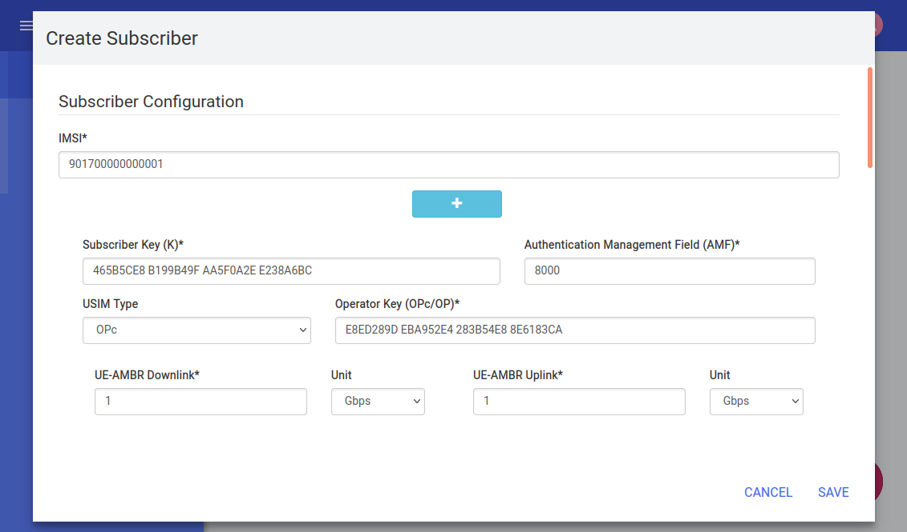
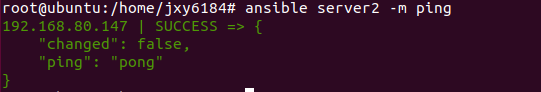

# Open5GS and UERANSIM deployment

- [Requirements](#requirements)
- [Configuration steps](#configuration-steps)

- [Project Main Page](https://github.com/J1mmy99/6184_5G_ansible_deployment)


### Requirements
The installation can be done directly over the host operating system (OS) or inside a virtual machine (VM).   

**System requirements**

Open5GS(5G Core network) deployment
- CPU type: x86-64 (specific model and number of cores only affect performance)
- RAM: 4 GB
- Disk space: 20 GB
- Ubuntu 18.04 LTS

UERANSIM(5G UE & 5G RAN) deployment
- CPU type: x86-64 (specific model and number of cores only affect performance)
- RAM: 4 GB
- Disk space: 20 GB
- Ubuntu 18.04 LTS

### Configuration steps
The following steps are required to complete setup.

**On server1:**

**1. Install git**      
    
``` sudo apt git ``` 

**2. Install ansible**      
    
``` sudo apt ansible ```

**3. Clone this repository**      
    
``` git clone https://github.com/J1mmy99/6184_5G_ansible_deployment.git ```

**4. Go to the folder**      
    
``` cd 6184_5G_ansible_deployment/ ```
``` cd Open5GS_and_UERANSIM_deployment ```

**5. Run ansible playbook**

``` ansible-playbook ansible_core_network.yaml ```

**6. Test Open5GS web interface**

``` http://localhost:3000 ```  

  User name : admin  
  Password :1423   
  


**7. Add new subscriber**

The default device information can be found in open5gs config on UERANSIM.

IMSI: 901700000000001

Subscriber Key: 465B5CE8B199B49FAA5F0A2EE238A6BC

USIM Type: OPc

Operator Key: E8ED289DEBA952E4283B54E88E6183CA



If you close the terminal, you can go to webui folder and run

``` npm run dev --host 0.0.0.0 ```  

to restart Open5GS.

**8.Create public key**

``` ssh-keygen -t rsa ```  

**9.Distribute public key to server2**

``` ssh-copy-id -i ~/.ssh/id_rsa.pub root@server2_ip_address ```

Be aware you may need to install openssh-server and change sshd configuration on server2 by doing this:

``` sudo apt-get install openssh-server ```

``` sudo vim /etc/ssh/sshd_config ```

``` 
PermitRootLogin yes

PubkeyAuthentication yes

PasswordAuthentication yes
```

``` sudo service sshd restart ```

**10.Configure ansible**

``` vim /etc/ansible/hosts ```

``` 
[server2]
server2_ip_address
```

**11.Test ansible communication**

``` ansible server -m ping ``` 

Be aware you may need to install ansible on server2:

``` sudo apt install ansible ```



**12.Go to folder **

``` cd Open5GS_and_UERANSIM_deployment ```

**13.Run playbook for server2 **

``` ansible-playbook ansible_UE_gnb.yaml ```


